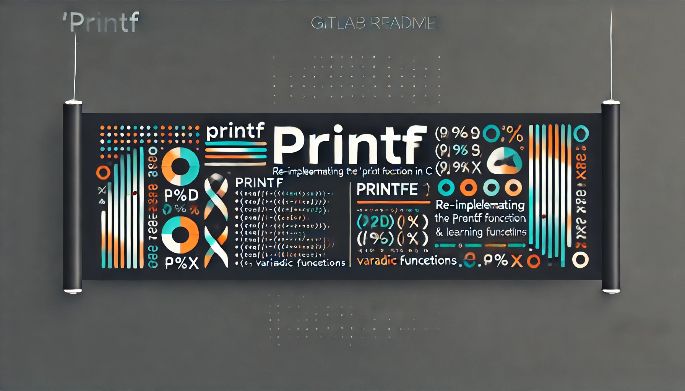

## Projet : Ft_Printf

Une réimplémentation partielle du printf en C. Gère uniquement les conversions suivantes.

| Conversion | Description |
|------------|------------------------------------|
| %c         | Imprimer un seul caractère.        |
| %s         | Imprimer une chaîne de caractères. |
| %p         | L'argument pointeur void * est imprimé en hexadécimal. |
| %d         | Imprimez un nombre décimal (base 10). |
| %u         | Imprimez un nombre décimal non signé (base 10). |
| %x         | Imprimez un nombre en hexadécimal (base 16), avec des minuscules. |
| %X         | Imprimez un nombre en hexadécimal (base 16), avec des majuscules. |
| %%         | Imprimez un signe de pourcentage.  |

## Notions

- Spécificateurs de format : Comprendre les différents spécificateurs de format (par exemple, %d, %s, %c, %x, etc.) et leur utilisation.

- Fonctions variadiques : Utiliser les fonctions variadiques en C, en particulier stdarg.h, pour gérer un nombre variable d'arguments.

- Conversion des types : Savoir comment convertir différents types de données (entiers, caractères, chaînes) en chaînes de caractères pour l'affichage.

- Utilisation de la norme : Suivre les normes de codage de l'école 42 pour le style et la structure du code.

## Language

- C